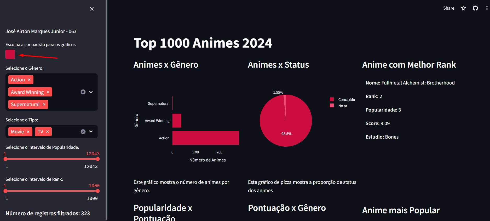

# Desafio Python - Top Anime Dataset 2024

## Descrição Geral

O projeto "Desafio Python - Top Anime Dataset 2024" é uma atividade do Projeto Desenvolve - Itabira que tem como objetivo aplicar os conhecimentos adiquiridos nas aulas de Python e procura de conteúdo a respeito de bibliotecas específicas como Streamlit, Plotly e Pandas, através da criação de um dashboar interativo para visualizar e analisar dados relacionados à uma base escolhida.

A base escolhida foi [Top Anime Dataset 2024](https://www.kaggle.com/datasets/bhavyadhingra00020/top-anime-dataset-2024), se destacando por se tratar de um tema de interesse significativo do autor, cuja análise resulta em insights valiosos e aplicáveis ao contexto diário.

A criação do dashboard permite aos usuários filtrar os animes com base em diferentes critérios como gênero, tipo, popularidade e rank. Além disso, fornece visualizações gráficas para uma melhor compreensão dos dados.

## Demonstração de Uso

1. **Filtragem por Gênero e Tipo:** Na barra lateral, é possível selecionar os gêneros e tipos de animes desejados. Basta clicar nas opções disponíveis e os gráficos serão atualizados automaticamente de acordo com as seleções feitas.

 

2. **Filtragem por Popularidade e Rank:** Utilize os controles deslizantes para definir os valores mínimo e máximo de popularidade e rank dos animes que deseja visualizar. Os gráficos serão ajustados conforme os intervalos selecionados.

 

3. **Visualização dos Resultados:** Os gráficos e estatísticas atualizados serão exibidos na página principal do dashboard. Cada gráfico fornece insights valiosos sobre os dados filtrados, permitindo uma análise detalhada dos animes de acordo com os critérios escolhidos.

 

4. **Interpretação dos Gráficos:** É possível alterar a cor dos gráficos apresntados a fim de se obter a melhor visualização. Os gráficos de barras e pizza oferecem uma visão geral da distribuição dos gêneros de animes e do status de transmissão. O gráfico de dispersão mostra a relação entre popularidade e pontuação, enquanto o histograma apresenta a distribuição da duração dos episódios. Por fim, o gráfico de caixa permite comparar os scores dos animes por gênero.

### Tecnologias Utilizadas
- **Linguagem de Programação:** 
    Python
- **Bibliotecas e Frameworks:**
  - Streamlit: Utilizado para criar a interface do usuário interativa.
  - Plotly e Plotly Express: Utilizados para gerar visualizações interativas de dados.
  - Pandas: Utilizado para manipulação e análise de dados.
  - Matplotlib: Utilizado para criação de gráficos estáticos.
  - Re: Utilizado para manipulação de expressões regulares.

## Informações sobre os Dados Originais

A base de dados utilizada neste projeto contém informações detalhadas sobre os 1000 animes mais populares, incluindo:

- **Rank**: A posição do anime no ranking.
- **Title**: O título do anime.
- **Score**: A pontuação do anime.
- **Popularity**: A popularidade do anime.
- **Type**: O tipo do anime (ex. TV, Movie).
- **Studios**: Os estúdios que produziram o anime.

### Primeira linha do DataFrame ###

  | Score|  Popularity | Rank |  Members | ...  |                         Genres                   |     Demographic |    Duration     |               Rating            |
  |------|-------------|------|----------|------|--------------------------------------------------|-----------------|-----------------|---------------------------------|
  | 9.38 |       284   |  1   |   710    | ...  |   AdventureAdventure, DramaDrama, FantasyFantasy |  ShounenShounen | 24 min. per ep. |      PG-13 - Teens 13 or older  |

## Instruções para Executar o Projeto

1. Clone este repositório:
   
    git clone https://github.com/Airton659/streamlit_063.git
   
2. Instale as dependências necessárias:
   
    pip install -r requirements.txt

3. Execute o aplicativo Streamlit:
   
    streamlit run caminho\da\pasta\animes.py

   
